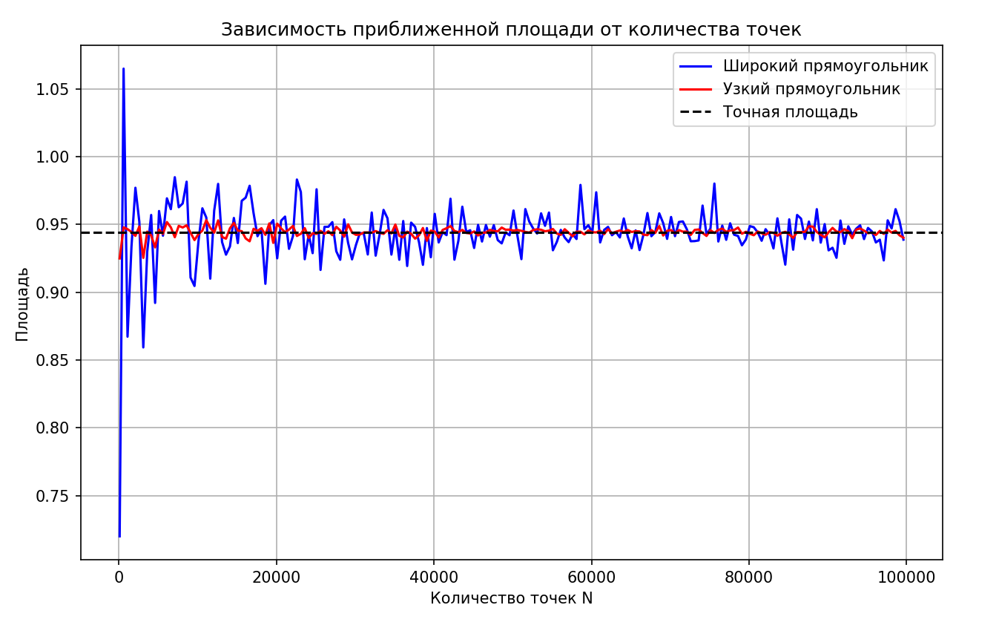
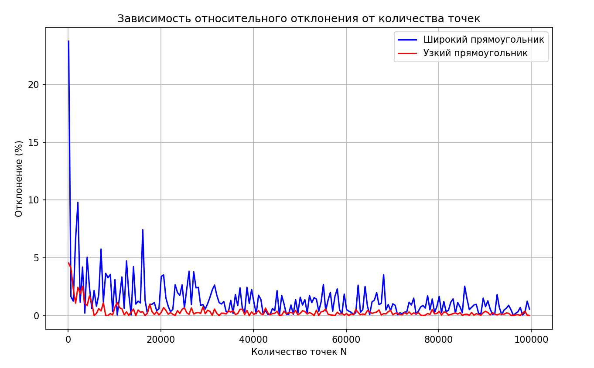

# Отчёт

ID посылки на Codeforces: 349177725

Ссылка на репозиторий: https://github.com/Marlinpa/Algorithms/Set_3/A1

- `a1.cpp` - решение поставленной задачи из условия
- `data_1.txt` - данные вычисления площади способом, где прямоугольник широкий
- `data_2.txt` - данные вычисления площади способом, где прямоугольник узкий

#### Вывод:
Для повышения точности расчета площади следует использовать больше точек, чтобы лучше покрыть исследуемое пространство. 
Кроме того, уменьшение области выбора точек также увеличивает точность, так как повышает вероятность попадания точки в нужную зону.