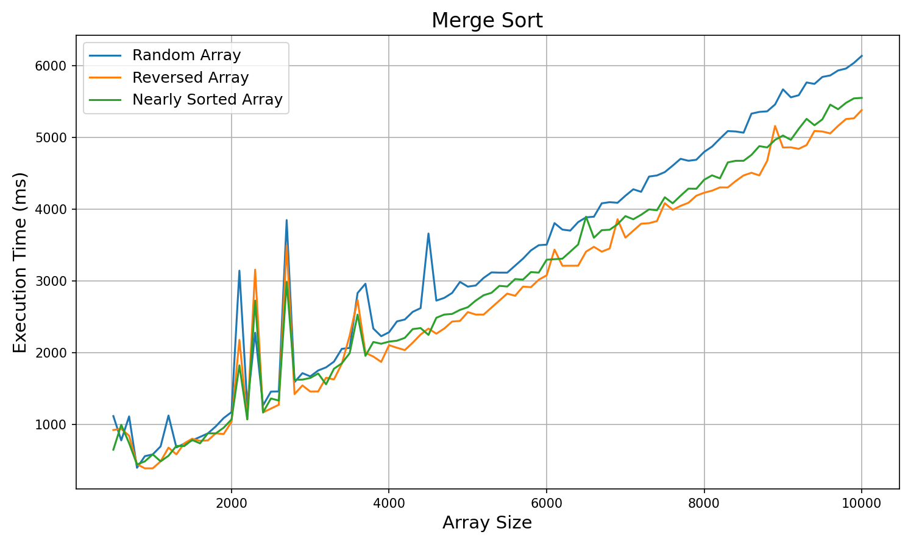
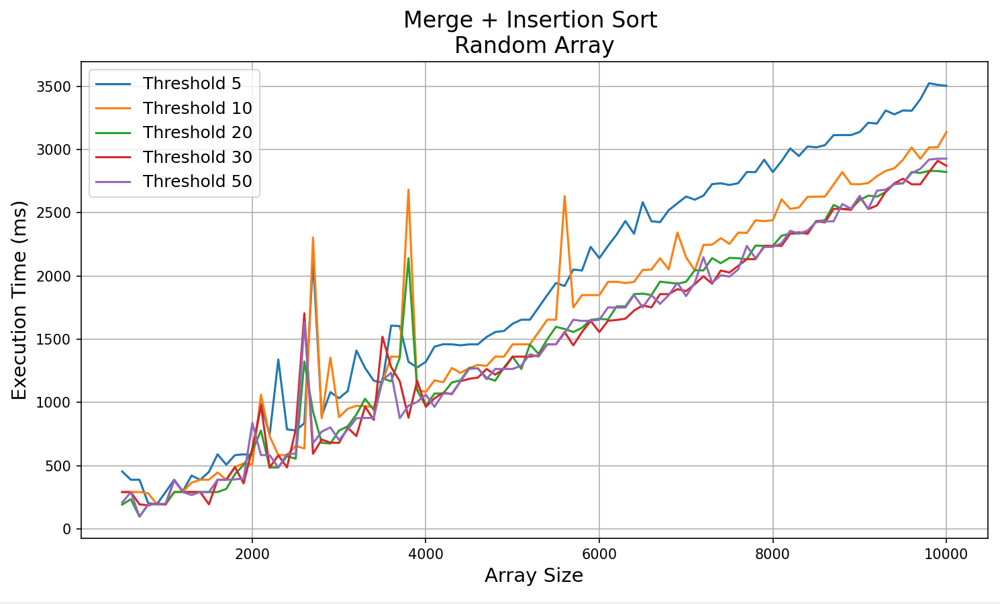
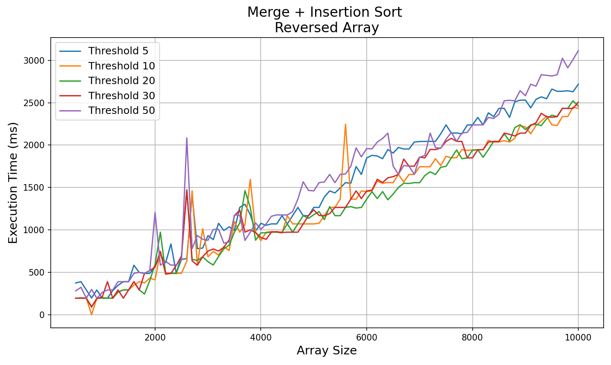
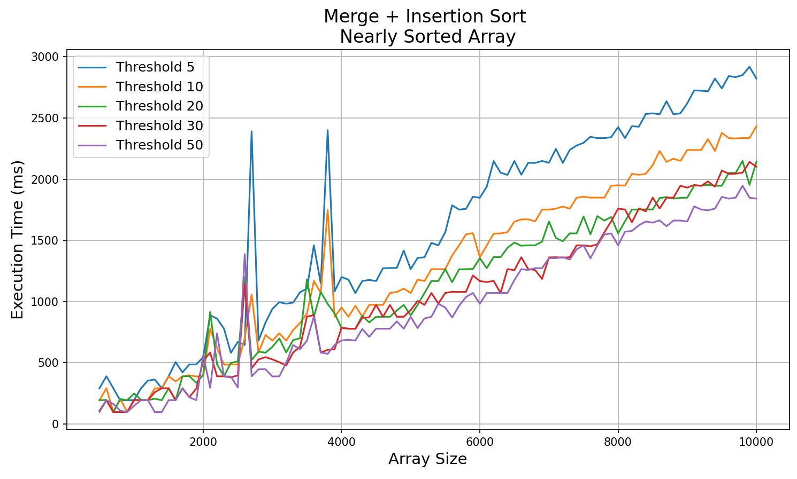

# Отчёт

ID посылки на Codeforces: 349319171

Ссылка на репозиторий: [https://github.com/Marlinpa/Algorithms/Set_3/A2](https://github.com/Marlinpa/Algorithms/edit/main/Set_3/A2)

- `a2.cpp` - реализация классов ArrayGenerator и SortTester, реализация сортировок
- `merge_random.txt` - измерения, сделанные алгоритмом merge sort на рандомном массиве
- `merge_reversed.txt` - измерения, сделанные алгоритмом merge sort на перевернутом массиве
- `merge_nearly_sorted.txt` - измерения, сделанные алгоритмом merge sort на почти отсортированном массиве
- `hybrid_random.txt` - измерения, сделанные алгоритмом merge + insertion sort на рандомном массиве
- `hybrid_reversed.txt` - измерения, сделанные алгоритмом merge + insertion sort на перевернутом массиве
- `hybrid_nearly_sorted.txt` - измерения, сделанные алгоритмом merge + insertion sort на почти отсортированном массиве
  (присутствуют все измерения, зависящие от threshold)

### Графики:

### Вывод:
1. __Преимущество гибридного алгоритма__

   Гибридный алгоритм Merge + Insertion Sort демонстрирует значительное ускорение по сравнению со стандартным 
   Merge Sort для массивов малого и среднего размера (до 8000 элементов). Ускорение достигает примерно 25-40% благодаря 
   замене рекурсивных вызовов на более эффективный Insertion Sort для небольших подмассивов.

2. __Зависимость от порогового значения (threshold)__

   Эффективность гибридного алгоритма сильно зависит от выбора порога переключения:
   - Порог 5-10: Оптимален для малых массивов, но может приводить к избыточным переключениям на больших данных

   - Порог 20-30: Наиболее стабильные результаты для различных размеров массивов

   - Порог 50: Наилучшие результаты для случайных и почти отсортированных массивов.
   Для обратно отсортированных массивов порог 50 уступает меньшим порогам (10-20), что объясняется особенностями 
   поведения Insertion Sort на строго убывающих последовательностях.

3. __Оптимальный порог перехода__

   На основе анализа графиков оптимальным пороговым значением является 30 элементов. 
   При этом значении гибридный алгоритм показывает стабильную производительность без резких скачков времени выполнения 
   для всех типов массивов.