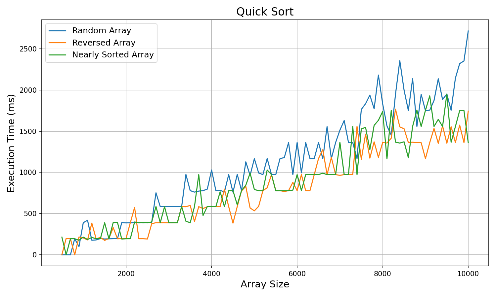
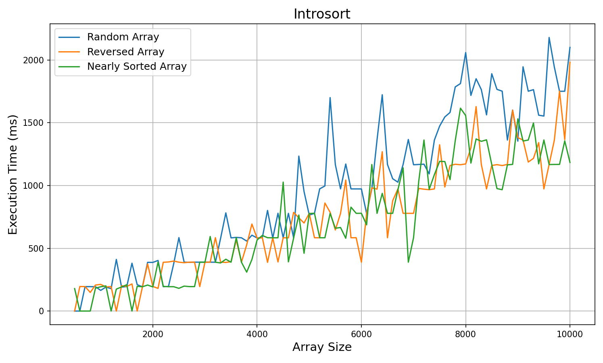

# Отчёт

ID посылки на Codeforces: 349351695

Ссылка на репозиторий: [https://github.com/Marlinpa/Algorithms/Set_3/A3](https://github.com/Marlinpa/Algorithms/edit/main/Set_3/A3)

- `a3.cpp` - реализация классов ArrayGenerator и SortTester, реализация сортировок
- `quick_random.txt` - измерения, сделанные алгоритмом quick sort на рандомном массиве
- `quick_reversed.txt` - измерения, сделанные алгоритмом quick sort на перевернутом массиве
- `quick_nearly_sorted.txt` - измерения, сделанные алгоритмом quick sort на почти отсортированном массиве
- `hybrid_random.txt` - измерения, сделанные алгоритмом introsort на рандомном массиве
- `hybrid_reversed.txt` - измерения, сделанные алгоритмом introsort на перевернутом массиве
- `hybrid_nearly_sorted.txt` - измерения, сделанные алгоритмом introsort на почти отсортированном массиве

### Графики:

### Вывод:
На основе экспериментального анализа можно выделить ключевое отличие: 
Introsort обеспечивает стабильную производительность на всех типах данных, 
тогда как стандартный Quick Sort подвержен резкой деградации на отсортированных массивах. 
Это связано с механизмом переключения на Heap Sort при превышении глубины рекурсии, что 
гарантирует сложность O(n log n) даже в худшем случае.

На случайных и почти отсортированных массивах оба алгоритма демонстрируют сопоставимую эффективность, 
при этом стандартный Quick Sort показывает незначительное преимущество благодаря меньшим накладным расходам. 
Практическая ценность Introsort заключается в его универсальности — он сохраняет высокую скорость на типичных 
наборах данных, одновременно обеспечивая защиту от редких, но критичных случаев деградации производительности.